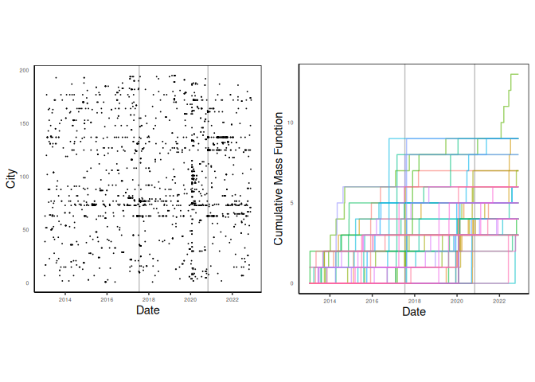
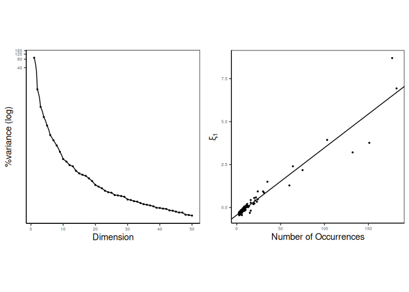
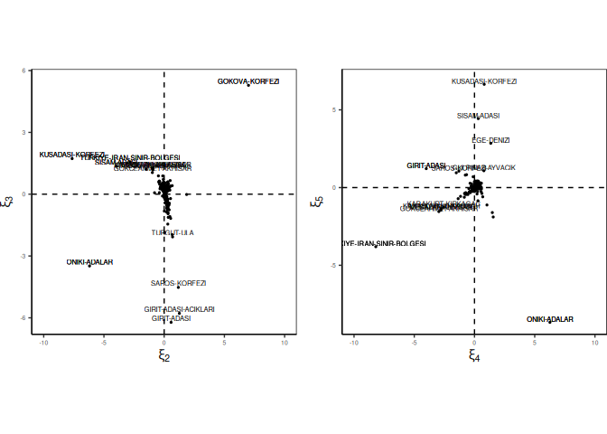
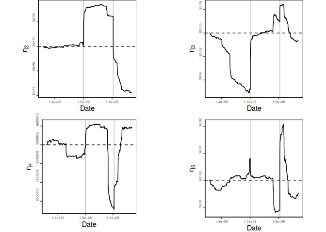

<!-- README.md is generated from README.Rmd. Please edit that file -->

# Point Process Principal Component Analysis

<!-- badges: start -->
<!-- badges: end -->

> :warning: The `{pppca}` package is under final development stage
> (documentation, unit testing, etc.). You can already use it as the
> code is not expected to change much before its official release.

The `{pppca}` R package provides an implementation of the Principal
Component Analysis (PCA) framework for point process data.

See Picard et al (2024) for more details about the method.

## Authorship and license

This package is developed by:

- Franck Picard
  ([link](https://franckpicard.github.io/)\|[ORCID](https://orcid.org/0000-0001-8084-5481))
- Ghislain Durif
  ([link](https://gdurif.perso.math.cnrs.fr/)\|[ORCID](https://orcid.org/0000-0003-2567-1401))

The `{pppca}` package is available under the GPL\>=3 license (except for
the included `earthquake` dataset, see `?earthquake` or the
[`LICENSE`](./LICENSE) file).

## Installation

You can install the development version of `{pppca}` from
[GitHub](https://github.com/) with:

``` r
# install.packages("remotes")
remotes::install_github("franckpicard/pppca")
```

## Usage

See the tutorial [below](#below) made with the vignette [“PCA for Point
Processes with Earthquake Data”](vignettes/01-introduction-pppca.Rmd):

``` r
vignette("01-introduction-pppca", package = "pppca")
```

## Note for developpers

The `{pppca}` package is developed using the
[`{fusen}`](https://thinkr-open.github.io/fusen/index.html) framework to
generate R packages. Check the [`dev`](./dev) folder in the git
repository for the sources and recipe.

See the [`TODO.md`](./TODO.md) file in the git repository for
information about ongoing development work.

# Tutorial

``` r
library(pppca)
```

<!-- WARNING - This vignette is generated by {fusen} from dev/flat_full.Rmd: do not edit by hand -->
<!-- {fusen} related framework -->
<!-- knitr setup -->
<!-- vignette setup -->

## pppca package

In this document, you will find a tutorial about using the `{pppca}`
package that implement Principal Component Analysis for point process
data.

## Data

The data were obtained from the Kandilli Observatory and Earthquakes
Research Institute at Boğaziçi University[^1]. The dataset comprises
earthquake occurrences in Turkey and neighboring regions of Greece,
recorded between January 2013 and January 2023, spanning 1181 cities. In
recent years, the Gulf of Gökova in Southwest Turkey has witnessed two
significant seismic events: the Bodrum earthquake on July 20, 2017
(magnitude 6.6, also felt on the Greek island of Kos), and the Aegean
Sea earthquake on November 1st, 2020, with a moment magnitude of 7.0
(the highest magnitude observed during the period). In the following, we
illustrate how our framework can be employed to investigate the
fine-scale dynamics of earthquake occurrences in the region, focusing on
the 195 cities that experienced more than two earthquakes over the
specified period.

> **Important:** per its original licensing, this dataset should be used
> only for scientific and non-commerical purposes. Upon use of this
> dataset, proper attribution should be given to B.U. KOERI-RETMC
> (Boğaziçi University Kandilli Observatory and Earthquake Research
> Institute - Regional Earthquake-Tsunami Monitoring Center) in
> scientific articles and general purpose reports by referencing the
> KOERI Catalog citation.

``` r
head(earthquake)
#> $`ACIKGUNEY-KIGI`
#> [1] "2016-05-20 18:46:48 GMT" "2015-12-04 16:00:14 GMT"
#> [3] "2015-12-04 15:37:40 GMT" "2015-12-02 23:32:07 GMT"
#> [5] "2018-03-07 07:58:41 GMT" "2015-12-16 05:31:24 GMT"
#> [7] "2015-12-03 00:36:24 GMT"
#> 
#> $AGARTI
#> [1] "2013-11-11 07:20:48 GMT" "2020-02-17 20:16:50 GMT"
#> [3] "2020-02-17 20:18:58 GMT" "2021-06-24 13:59:39 GMT"
#> [5] "2014-03-05 12:03:29 GMT"
#> 
#> $`AGASENLIGI-PULUMUR`
#> [1] "2015-02-09 21:58:12 GMT" "2015-02-09 22:52:49 GMT"
#> [3] "2016-01-14 10:59:21 GMT"
#> 
#> $`AHMETADIL-AKYURT`
#> [1] "2020-01-23 03:54:12 GMT" "2019-06-28 10:55:02 GMT"
#> [3] "2020-01-27 10:51:25 GMT" "2020-01-07 05:01:05 GMT"
#> [5] "2020-04-26 23:27:10 GMT"
#> 
#> $AKCAKENT
#> [1] "2020-09-24 04:26:47 GMT" "2020-09-24 01:01:24 GMT"
#> [3] "2020-09-21 03:37:30 GMT" "2020-09-30 04:15:33 GMT"
#> 
#> $AKCAKOY
#> [1] "2019-12-11 13:15:45 GMT" "2020-03-24 09:20:11 GMT"
#> [3] "2020-07-12 12:14:01 GMT" "2019-12-10 20:14:02 GMT"
```

## Model

The earthquake occurrences are modeled with $n$ independent and
identically distributed (i.i.d.) temporal point processes
$(N_1, N_2, \ldots, N_n)$, observed on the time interval $[0,1]$, such
that: $$
N^i = (T^i_1, T^i_2,...), \quad T^i_1< T^i_2 < ...
$$

Our method is based on the associated *cumulative mass functions* of the
processes (called counting processes), such that $$
\Pi_i([0,t]) = \sum_{T \in N_i} 1_{ \left\{ T<t \right\}}.
$$

<div class="figure" style="text-align: center">


<p class="caption">
Earthquake occurrences (left). Corresponding cumulative mass function
(CMF) for each of ther first 50 cities in the dataset (right). Grey
vertical lines corresponds to significant seismic events on 2017-07-16
and 2020-11-01.
</p>

</div>

### Empirical probability mass function

You can compute the empirical cumulative probability mass function (PMF)
with the `get_empirical_pmf()` function (c.f. previous figure):

``` r
emp_pmf <- get_empirical_pmf(earthquake)
```

### Empirical intensity function

We can also compute the empirical intensity function of a point process
realization, which is the numerical derivative of the empirical PMF
(c.f. [previously](#empirical-probability-mass-function)), with the
`get_empirical_intensity()` function:

``` r
emp_int <- get_empirical_intensity(earthquake)
```

## PCA for Point Processes

The Principal Component Analysis for Point Process data is based on the
Karhunen–Loève decomposition of the empirical *cumulative mass
functions*: $$
\Pi_i([0, t]) \approx W([0, t])+ \sum_{j = 1}^J\sqrt{\widehat{\lambda}_j} \widehat{\xi}_{i, j} \widehat{\eta}_{j}(t), \qquad t\geq 0
$$

where $W(\cdot)$ is the baseline function, $(\widehat{\lambda}_j)_{j}$
are the eigenvalues, $(\widehat{\xi}_{i, j})_{i,j}$ are the individual
scores over each component, and $(\widehat{\eta}_{j}(\cdot))_j$ are the
corresponding eigenfunctions.

See Picard et al. (2024) for more details.

The Point Process PCA (PPPCA) can be computed using the `pppca()`
function:

``` r
# conversion of dates to numerical values
earthquake_num <- lapply(earthquake, as.numeric)
# apply principal component analysis to point process data
pppca_res <- pppca(earthquake_num, Jmax = 50, mc.cores = 1)
```

As in classical PCA, we first inspect the percentage of variance carried
by each axis:

``` r
head(pppca_res$percentvar)
#> [1] 89.5771138  7.0232618  1.7091763  0.7541369  0.3792620  0.1746328
```

The first axis carries
$\widehat{\lambda}_1/\sum_j \widehat{\lambda}_j = 89\%$ of the
variability. This implies that the first source of variance in the data
is associated with the deviation of cities in the accumulation of
earthquakes over time compared to the average temporal pattern of
earthquakes in the region.

<div class="figure" style="text-align: center">


<p class="caption">
Percentage of explained variance for each principal component (left).
Individual score on the first component versus the number of occurrences
for each individual (right).
</p>

</div>

Also, scores on Axis 1 ($(\widehat\xi_{i1})_i$) directly correspond to
the total number of earthquakes in each city over the specified period
(c.f. previous figure). We identify Akdeniz as an outlier with an
unusually high number of earthquakes compared to the regional average.
This city will be excluded from subsequent analyses that investigate the
finer-scale dynamics of earthquake activity in the area.

<div class="figure" style="text-align: center">


<p class="caption">
Values of the first eigenfunction.
</p>

</div>

### Predicted PMF

From the PPPCA decomposition, we can reconstruct the predicted empirical
PMF using the Karhunen–Loève decomposition (c.f.
[previously](#pca-for-point-processes)) by using the
`get_predicted_pmf()` function:

``` r
# conversion of dates to numerical values
earthquake_num <- lapply(earthquake, as.numeric)
# apply principal component analysis to point process data
pppca_res <- pppca(earthquake_num, Jmax = 50, mc.cores = 1)
# reconstruct predicted PMF
pred_pmf <- get_predicted_pmf(
    earthquake, pppca_res$eigenval, pppca_res$scores, 
    pppca_res$eigenfun, mc.cores = 1
)
```

### Predicted intensity function

We can also compute the predicted intensity function of a point process
realization, which is the numerical derivative of the predicted PMF
(c.f. [previously](#predicted-pmf)), with the
`get_predicted_intensity()` function:

``` r
# conversion of dates to numerical values
earthquake_num <- lapply(earthquake, as.numeric)
# apply principal component analysis to point process data
pppca_res <- pppca(earthquake_num, Jmax = 50, mc.cores = 1)
# reconstruct predicted intensity function
pred_pmf <- get_predicted_intensity(
    earthquake, pppca_res$eigenval, pppca_res$scores, 
    pppca_res$eigenfun, mc.cores = 1
)
```

## Interpretation of scores

In order to interpret the subsequent axes, we recall that our method
summarizes the dynamics of earthquake occurrences through simple
functions (c.f. [previously](#pca-for-point-processes)).

Consequently, we focus on the variations of the estimated eigenfunctions
$(\widehat{\eta}_j)_j$, and represent the positions of cities according
to their scores $(\widehat{\xi}_j)_j$ on successive axes as in any PCA
analysis. These representations allow us to identify locations (like
Gökova Körfezi or On İki Adalar a.k.a Dodecanese islands) that have
typical accumulations of earthquakes over the period.

<div class="figure" style="text-align: center">


<p class="caption">
Individual location scores for components 2 and 3 (left) and components
4 and 5 (right).
</p>

</div>

## Interpretation of eigenfunctions

Eigenfunctions can be interpreted as the basic components that drive the
dynamics of earthquake occurrences over time. Interestingly, the second
axis, $\widehat\eta_2$ reveals a distinct change in seismic activity
between the two main earthquakes (2017 and 2020). Cities exhibiting
positive scores on this axis indicate a global increase in earthquake
rates between July 2017 and November 2020, followed by a decrease below
the average regional rate after November 2020. Conversely, cities with
negative scores on $\widehat{\eta}_3$ show an accumulation of
earthquakes before July 2017. Overall, our method provides a highly
accurate description of the variability in earthquake occurrences among
different cities. It offers a means to represent and position cities
relative to each other based on their earthquake dynamics variability.
Moreover, our estimation framework, relying on occurrence data without
smoothing, captures sharp and fine-scale variations in this dynamics, as
shown by the distinct peaks in $\widehat{\eta}_4$ and $\widehat{\eta}_5$

<div class="figure" style="text-align: center">


<p class="caption">
Values of the second, third, fourth and fifth eigenfunctions.
</p>

</div>

## References

<div id="refs" class="references csl-bib-body hanging-indent"
entry-spacing="0">

<div id="ref-picard2024" class="csl-entry">

Picard, Franck, Vincent Rivoirard, Angelina Roche, and Victor Panaretos.
2024. “PCA for Point Processes.” arXiv.
<https://doi.org/10.48550/arXiv.2404.19661>.

</div>

</div>

[^1]: <http://www.koeri.boun.edu.tr/sismo/2/earthquake-catalog/>
